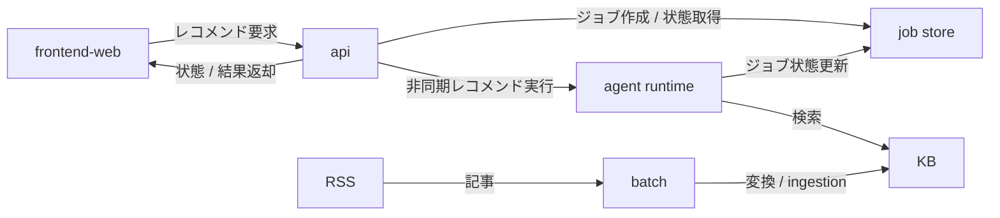
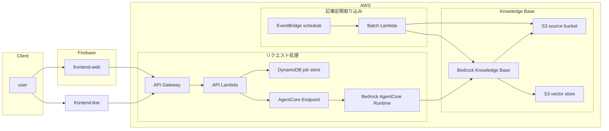

# AGENTS.md

## プロジェクト概要

`./README.md` を参照

現状ソース上の主対象は AWS 公式 RSS 記事。

## アーキテクチャ、ディレクトリ構成

### ディレクトリ構成

- `api`: レコメンドジョブ受付 API。FastAPI。非同期 worker 連携。
- `agent`: レコメンドAI Agent。
- `batch`: RSS 取得結果を Knowledge Base 投入用データへ変換、ingestion 起動。
- `frontend-web`: Web 向けフロントエンド。Vite + React + TypeScript。
- `frontend-line`: LINE ミニアプリ向けフロントエンド。Vite + React + TypeScript。
- `infra`: AWS リソース定義。Pulumi TypeScript。

### 大枠フロー



### インフラ構成図




## セットアップ・コマンド

前提:

- Python 系は `uv`
- Frontend / Infra は `yarn`
- AWS 操作時 `aws` CLI 設定済み

主要コマンドは build のみ記載。

Python 系 build は zip 化前提。

### ビルドコマンド

#### API Lambda zip build

```sh
cd api
rm -rf build/package build/api-lambda.zip
rm -rf build/dist build/lib tech_article_recommender_api.egg-info
mkdir -p build/package
uv build --wheel --out-dir build/dist
uv pip install \
  --python-platform aarch64-manylinux2014 \
  --python-version 3.13 \
  --target build/package \
  --only-binary=:all: \
  build/dist/*.whl
cd build/package
zip -r ../api-lambda.zip .
```

#### Agent runtime zip build

```sh
cd agent
rm -rf build/package build/strands-runtime.zip
mkdir -p build/package
uv build --wheel --out-dir build/dist
uv pip install \
  --python-platform aarch64-manylinux2014 \
  --python-version 3.13 \
  --target build/package \
  --only-binary=:all: \
  build/dist/*.whl
cp main.py build/package/
cd build/package
zip -r ../strands-runtime.zip .
```

#### Batch Lambda zip build

```sh
cd batch
rm -rf build/package build/rss-batch.zip
mkdir -p build/package
uv build --wheel --out-dir build/dist
uv pip install \
  --python-platform aarch64-manylinux2014 \
  --python-version 3.13 \
  --target build/package \
  build/dist/*.whl
cd build/package
zip -r ../rss-batch.zip .
```

#### Web フロント build 
```sh
cd frontend-web && yarn build
```

#### LINE フロント build
```sh
cd frontend-line && yarn build
```

#### Infra preview
```sh
cd infra && yarn pulumi preview
```

## 禁止操作

- 秘密情報 commit。`.env` 実値、AWS credential、token 類含む
- 無関係ファイル巻き込み変更
- 既存生成物や build artifact を根拠なく手編集
- `git reset --hard` `git checkout --` で他者変更破棄
- schema 変更後、古い build 生成物残したまま Lambda package 作成
- 到達確認なしで RSS URL を KB 投入対象へ追加

## 作業フロー

### 基本フロー

1. 変更対象 README / 設定 / 依存関係確認
2. 対象ディレクトリ限定で実装
3. 影響範囲のローカル確認
4. build 確認
5. 差分確認。無関係変更混入除去
6. 変更理由、確認結果、未確認点共有

### 推奨確認

- API変更: ローカル起動確認
- Agent変更: CLI 実行で最低1件確認
- Batch変更: handler 直接実行、URL 到達確認ロジック確認
- Frontend変更: `yarn build`、主要画面動作確認
- Infra変更: `yarn pulumi preview`

### 運用メモ

- 破壊的操作前は必ず確認
- `api` は schema 変更時 `build/lib` と `tech_article_recommender_api.egg-info` 削除必須。旧 schema 混入防止
- モノレポなので対象外 package の差分は触らない
- README と実装ズレ発見時は、可能なら同一変更で追随
- RSS各記事URL は KB投入前に到達確認。`HEAD` 失敗時 `GET` fallback。`404` `410` 接続失敗 URL は除外
- `frontend-line` は LIFF 前提。`VITE_LIFF_ID` `VITE_API_BASE_URL` `VITE_POLL_INTERVAL_MS` `VITE_POLL_TIMEOUT_MS` 管理
- API 認証は `Authorization: Bearer ...` 形式前提。LINE フロントは LIFF ID token 優先、無ければ access token
- `scripts/rss_to_kb_documents.py` 出力は `1記事1ファイル`。metadata は短い filterable 属性のみ、本文は `.md` 側
